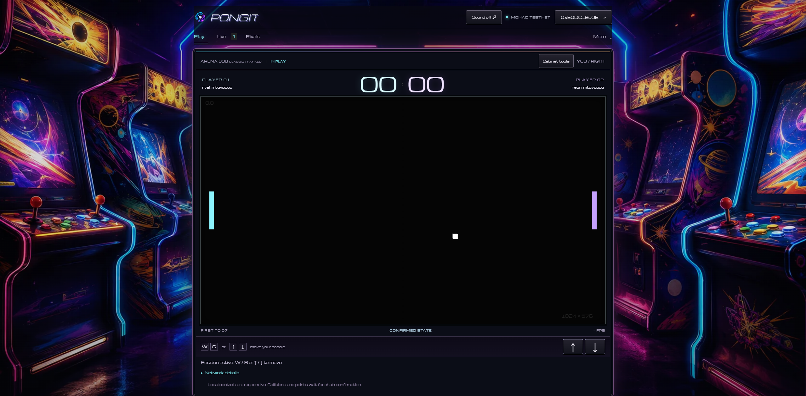
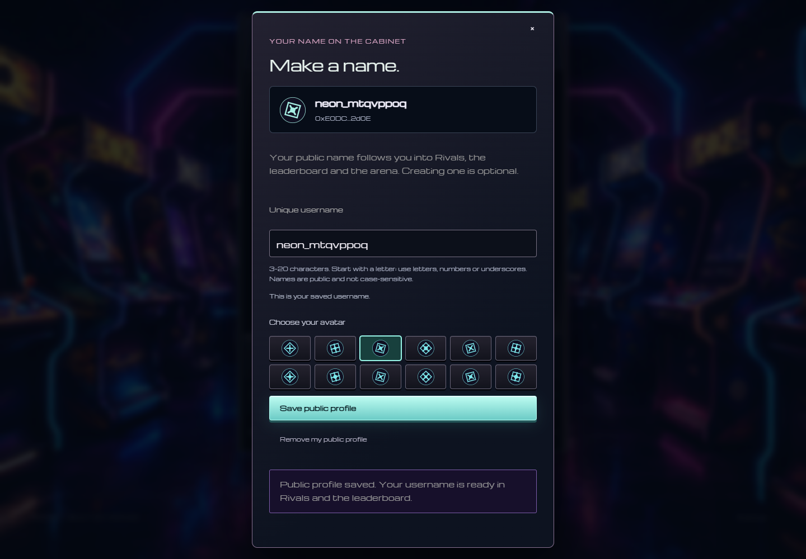

# Arcade hall and player tags

The home cabinet and game rules stay unchanged. A static illustrated arcade hall replaces the sparse cabinet silhouettes. The court remains opaque and dark; room intensity and the background-off setting are preserved. There are no background animations, parallax, canvas renderers or continuously running effects.

## Public player tags

Use **Create your profile** beneath the home cabinet controls. Connecting or renewing a passkey continues directly into the editor, without joining matchmaking. A profile remains optional. The same editor is also available in Rivals.

Usernames use 3–20 ASCII letters, digits or underscores, start with a letter and are normalized to lowercase. The existing PostgreSQL unique constraint is the final authority, including concurrent reservations. Saves are authenticated against the connected account. The availability check is advisory; a successful check does not reserve the name. Public names remain linked to their verifiable wallet addresses.

Saved usernames appear in home player tags, profile search, the leaderboard and the arena scoreboard. Reopening the site loads the profile from the server. Removing a profile does not remove match history or financial rights. Profile changes invalidate leaderboard caches. Search now preserves literal underscores and accepts full 42-character addresses.

No contract, financial permission or database migration is required. Existing profiles remain valid.

## Background asset provenance

Generated using the built-in image generation tool, then encoded as WebP with Sharp. The two user-supplied arcade photos served as mood references; the resulting room contains no people, copied signage or brand names.

- Desktop asset: `web/public/art/arcade-hall.webp` (1672 × 941, approximately 252 kB).
- Mobile asset: `web/public/art/arcade-hall-mobile.webp` (960 px wide, approximately 75 kB).
- The generated source stays outside Git; only the optimized assets ship with the site.

Final generation prompt:

> Use case: stylized-concept. Generate a NEW production website background asset for PONGIT, landscape 2560x1440 if possible. References are mood references only: extravagant color and richly decorated arcade machines, not their people or trademarks. Scene: an immersive empty 1980s retro-futurist arcade hall at night. Two close rows of fantastical upright arcade cabinets on the LEFT and RIGHT outer thirds, receding toward the middle; sculpted black cabinets, chrome edging, outrageous abstract side-panel illustrations of cosmic racing stripes and planets, amber marquee lightboxes with abstract symbols, bright continuous cyan, fuchsia, electric blue and yellow neon trims, tactile joysticks and candy-colored buttons. Angular ceiling neon arches frame the top. Rich reflected light on a dark polished floor, atmospheric haze, deep midnight violet shadows. Make it tangible, lavish and art-directed, like a premium cinematic game environment, not sparse vector art, not a generic synthwave grid. COMPOSITION is critical: cabinets visibly fill the outer left and right 28 percent of the image from top quarter to bottom, with foreground cropped cabinet corners at the extreme edges. Reserve a relatively quiet DARK central aisle (roughly central 44 percent), for a large rectangular game UI that will overlay the image; no central hero machine or distracting bright center. Do not draw any website UI, game court, words, letters, logos, watermarks or people. Still background, no animation. Wide symmetrical spatial composition with naturally varied cabinets. Sharp crafted materials and subtle restrained bloom, saturated neon accents without blowing out cabinet detail. The central floor and ceiling are dark, colorful details concentrated at the edges.

## Rollback

Restore the preceding web and relayer images together using the existing VPS release procedure. This release adds no tables and changes no stored data format. Saved profiles are compatible with the preceding release. Keep the new asset and application image together, so the background URL remains available.

## Validation and screenshots

Nine browser scenarios passed on the private VPS test environment, then three passed on public HTTPS (desktop, small mobile and the complete two-player username flow). TypeScript checking and all 22 unit tests passed. The dependency audit reported no production vulnerabilities; the history scan reported no secrets. See [the validation record](ARCADE_HALL_VALIDATION.json) for scope and limitations.

