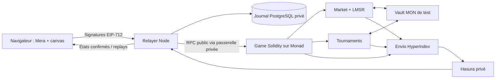

# Architecture et modèle de confiance

## Horloge et physique

La V1 fige 300 000 microsecondes par bloc dans `Game.BLOCK_US`, pour tous les matchs de ce déploiement. `IGameClock` expose l'horloge aux consommateurs ; porter le jeu sur une autre chaîne nécessitera un nouveau déploiement de son implémentation. Les blocs pendant une pause sont soustraits. Les timestamps fournis par le client ne déterminent jamais l'instant d'application d'une commande. Le timestamp de la chaîne sert seulement aux expirations et aux saisons.

Une commande avance d'abord l'état jusqu'au bloc d'inclusion, avec les anciennes directions ; la nouvelle direction s'applique ensuite. L'API publique `resolveEvent` traite au plus 64 événements par appel. Un keeper reprend le rattrapage si nécessaire. Les collisions mur/raquette et sorties sont calculées avec des entiers à précision 1e6 ; les dates d'événement sont arrondies vers le haut, les déplacements tronqués vers zéro. Les murs gagnent les égalités de date.

Le canvas extrapole pendant au plus 600 ms, puis attend la chaîne. Les scores affichés proviennent des snapshots confirmés. Chaque snapshot encode l'état complet en ABI, son numéro de version et l'horloge. Le replay Envio suit cette horloge et recalcule les déplacements entre snapshots. `replay-check.ts` compare les snapshots indexés aux logs RPC, vérifie la physique entre eux et l'état final du contrat.

## Comptes et autorisations

Mera crée/restaure une identité secp256k1 à partir du résultat PRF d'une passkey. HTTPS et un RP ID stable sont nécessaires. L'inscription exige la vérification utilisateur ; l'absence de PRF produit une erreur explicite. Certains authentificateurs nécessitent une seconde cérémonie après création pour vérifier PRF : il n'existe pas de garantie universelle détectable avant toute cérémonie.

Les clés dérivées sont des clés logicielles accessibles en mémoire. Aucun stockage des clés dans localStorage, IndexedDB ou la base. La session racine est fermée après autorisation ; une nouvelle cérémonie est demandée pour miser, retirer, révoquer ou concéder. La clé de jeu signe seulement `Input` et est liée au match, à une expiration et à un nombre de commandes. Les nonces sont consécutifs, les commandes expirent après au plus seize blocs et les signatures lient la chaîne et le contrat. La révocation est vérifiée par le contrat.

Les boutons « Local test player/operator » sont uniquement exposés quand l'API annonce `LOCAL_DEV=true` et chainId=31337. Ils servent aux tests automatisés et ne constituent pas une démonstration de passkey réelle.

## Relayer

Un verrou PostgreSQL réserve l'unique écrivain du compte sponsor. Le journal est lié à un déploiement et un signataire ; changer l'un des deux impose un nouveau journal. La transaction brute signée est persistée avant sa diffusion, puis rediffusée à l'identique après panne. Les reçus sont conservés avec le nonce et le coût plafonné. Le relayer simule les appels et vérifie plafond de gas, solde minimum, budget journalier, longueur de file et quotas IP. Le contrat applique ses propres limites de session.

Le matchmaking signe une intention avec expiration, puis exige deux consentements onchain portant sur le même adversaire. La V1 limite l'admission à quatre arènes simultanées pour borner les coûts. L'historique complet est paginé dans Envio ; les anciennes arènes actives sont redécouvertes progressivement après redémarrage. Les rounds de tournoi sont appariés selon le tableau du contrat et rattachés automatiquement.

L'ordre RPC, le relayer et les producteurs de blocs peuvent retarder ou censurer les commandes. Les reçus aident au diagnostic, sans démontrer une équité absolue. L'interface affiche des états inclus ; les réorganisations restent possibles. Envio gère ses checkpoints et réorganisations. Un nonce bloqué par un plafond de frais trop bas exige une intervention opérateur documentée ; aucune substitution silencieuse de transaction n'est effectuée.

## Fonds et marchés

Le coffre conserve un solde par propriétaire. Les deux seuls modules autorisés sont définitivement enregistrés puis scellés ; une clé de jeu ne peut pas débiter le coffre. Les achats et retraits utilisent leurs propres domaines EIP-712 et nonces du compte principal.

Le LMSR calcule `C(qA,qB)=b ln(exp(qA/b)+exp(qB/b))` avec log-sum-exp stable et PRBMath. Seuls les achats de parts sont disponibles en V1. Une part gagnante paie 1 MON par unité de 1e18 ; la perte maximale théorique `b ln(2)` est effectivement financée avant ouverture, plus marge. Les calculs restent dans des domaines bornés. Les quotes comportent une marge conservatrice, et **les réserves doivent couvrir séparément chaque issue et tous les remboursements après chaque achat**. Aucun invariant de solvabilité ne repose uniquement sur une approximation mathématique.

Les participants ne peuvent pas miser sur leur match. Les mises exigent la version exacte du jeu, une trajectoire dont aucune collision échue ne reste à résoudre et une distance au prochain impact supérieure au verrou figé pour ce marché (deux blocs par défaut). Les réclamations sont uniques. En cas d'annulation, toutes les sommes payées sont remboursables ; la trésorerie ne retire que les fonds au-delà des dettes restantes. Les signaux Envio sont des alertes de revue, sans sanction automatique ni identification prouvée des personnes.

## Compétition et administration

ELO onchain : 1000 initial, K=64 pour les dix placements puis 32 ; gains réduits par les rencontres répétées de la même paire dans une journée. Saison de 30 jours, rapprochement partiel vers 1000 pour chaque saison manquée. Les tournois utilisent un tableau de puissance de deux, frais optionnels et prix au vainqueur ; ils peuvent être annulés et remboursés si les inscriptions ou les rounds expirent.

Rôles AccessControl séparés : pause du jeu, pause du marché, administration et trésorerie. Le déploiement testnet exige explicitement les adresses admin et trésorerie ; leur qualité de multisig doit être vérifiée à la configuration. Les administrateurs Mera de l'interface nécessitent les rôles accordés par l’opérateur provisoire (commande authentifiée). Les transactions d'administration consomment le gas de l'administrateur.

## Paramètres du déploiement public

La balle parcourt 128 unités/s horizontalement et 64 verticalement ; la raquette 180 unités/s. Ces paramètres fixes rendent les fenêtres de décision utilisables avec les latences du RPC gratuit. Les commandes restent bornées à 16 blocs et ne modifient jamais le passé. Les confirmations du relayer sont mesurées séparément de la sonde réseau. La passerelle RPC privée partage un budget de 16,7 requêtes/s (RPC public Ankr, limite publiée de 20/s sur dix minutes) entre Envio et le relayer, groupe les lectures concurrentes et met brièvement en cache les blocs/estimations de prix du gas. Les lectures de contrat utilisent Multicall3. Le journal alloue les nonces à partir de la chaîne et de toutes les transactions persistées, même déjà confirmées.
