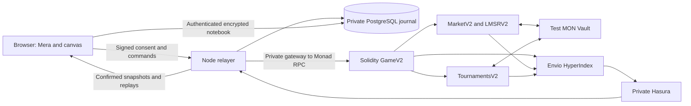

# Architecture and trust model

The notebook arrow represents storage through the authenticated relayer API; the browser never connects directly to PostgreSQL. [V2 rules and migration details](V2.md) complement this overview.

## Clock and physics

The match clock advances by 300,000 microseconds per included block, excluding game-pause blocks. Player-supplied timestamps cannot change the past. An input first advances physics using the previous directions, then applies the new direction at inclusion. Public bounded resolution allows a keeper to resume after a delay.

Solidity and TypeScript use fixed-point integers at precision 1e6, identical event ordering and rounding. Individual Chaos paddle heights remain frozen for each rally. Catch-up stops at the intermission; the next rally reads accepted betting pressure once before resuming. [Chaos rules](V2.md) specify thresholds and the betting lock.

The canvas predicts movement but waits at unresolved paddle impacts and uncertain points. Local paddle correction is gradual. Monotonic snapshot filtering prevents a late HTTP response from replacing newer WebSocket state. Confirmed scores remain authoritative. Envio stores full ABI snapshots, rules and handicap events for deployment-qualified replays.

## Accounts and authorization

Mera derives the existing wallet identity from a passkey PRF. HTTPS and a stable RP ID are required. Unsupported PRF authenticators produce an explicit error. Keys are software keys accessible in browser memory; they are not stored in localStorage, IndexedDB or the database.

Game session keys can sign only scoped inputs, with consecutive nonces, expiration and command limits. The owner separately authorizes bets, withdrawals, revocation and concession. Signatures bind the chain and contract; V2 join signatures also bind both accounts, mode, ranked status and rules version. The contract enforces these restrictions independently of the relayer.

App authentication uses a single-use signed challenge and a one-hour HttpOnly cookie. It authorizes profiles, invitations and encrypted notebook access only. The notebook uses a separate PRF namespace and nonextractable AES-GCM key, fresh IVs and account-bound authenticated data. Revision checks prevent silent cross-device overwrites. See [privacy details](V2.md#accounts-challenges-and-privacy).

Local test accounts are enabled only when both `LOCAL_DEV=true` and chain ID 31337 are reported. They are not passkey demonstrations.

## Relayer and versioning

One PostgreSQL advisory lock owns the sponsor's nonces. Signed raw transaction bytes are persisted before broadcast and reused after a crash. V2 registers an additional deployment manifest in the original journal, preserving V1 signed jobs and receipts. Legacy financial routes accept only claims, refunds and withdrawals.

Simulation, balance reservations, gas-price ceilings, queue bounds and abuse quotas precede submission. The optional daily ceiling is disabled in the live configuration at the owner's request. A well-funded Monad sender can avoid an unnecessary value-transfer waiting window while retaining conservative reserve accounting.

Separate Classic/Chaos queues and challenges reuse the same signed consent protocol. Each player can have only one active match creation. Submitted transactions retain their true receipt state instead of reporting a false cancellation. Tournament rounds use the onchain bracket.

The private RPC gateway shares a 60 ms request-spacing budget between relayer and indexer. Gameplay requests have priority over history, with fairness, coalesced reads and short caches. Fallback applies to reads; it does not independently resubmit transactions. Free RPC availability, relayer scheduling and block producers can still delay or censor inputs. Receipts support diagnosis, not a proof of absolute fairness.

## Markets and competition

The Vault keeps owner balances and sealed market/tournament modules. A game key cannot spend funds. LMSR buys use PRBMath log-sum-exp and bounded inputs. Initial liquidity is actually deposited; reserves must cover either winning outcome and cancellation refunds after every purchase. The theoretical loss bound alone is insufficient. There is no share resale in this release.

Participants cannot bet on their own match. Bets require a current game version, resolved past collisions and an open impact/intermission window. Claims settle once; cancelled matches permit refunds. Envio concentration signals support review without automatic sanctions or claims of identifying a person across accounts.

Classic ELO inherits V1; Chaos starts at 1000. Friendly matches do not update either ladder. Ranked rating finalization gates the next match independently of financial settlement. Tournaments remain Classic, with optional entry fees and funded prizes.

AccessControl separates game pause, market pause, administration and treasury permissions. The current test treasury is an EOA, not a multisig. Replacing an immutable treasury requires redeploying affected contracts. Administration uses the administrator's gas.

## Future transport

The active transport is Monad. The browser interface separates state, clock, notifications and confirmed results to prepare a future hosted Interlude adapter. That migration requires SDK, clock, recovery and operator trust validation plus compatible contracts. A live delegated value must not settle a market before the authoritative result is available on Monad.
