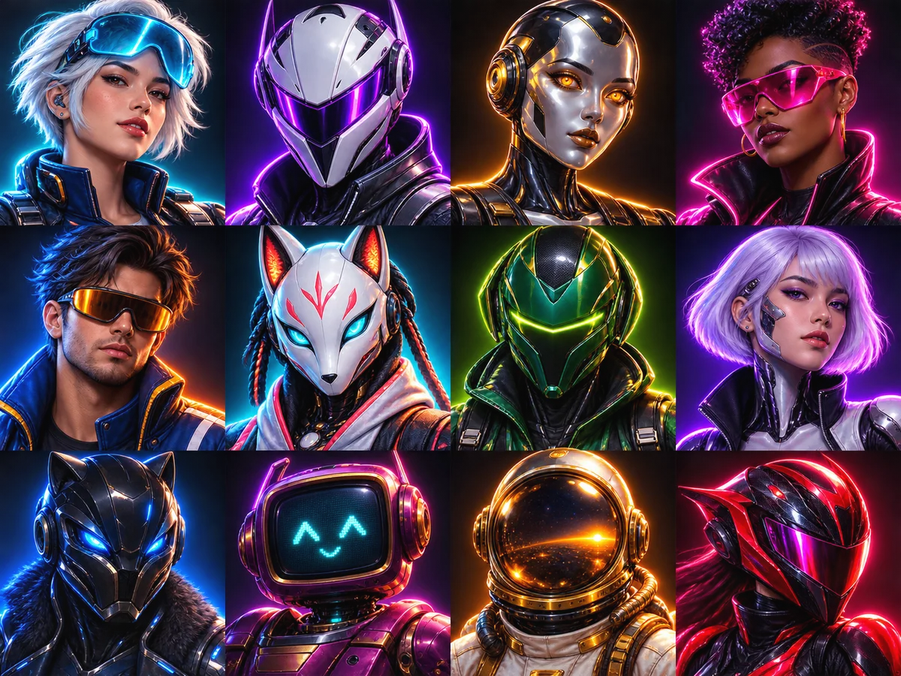

# PONGIT Player Select

The avatar system uses twelve illustrated characters across the home cabinet, public profiles, Rivals search and the leaderboard. Existing avatar IDs remain unchanged: profiles keep their saved selection without a database or contract migration.

## Interaction

- A large preview updates immediately; the selected character has a checkmark as well as an accent border.
- The selector is a radio group: arrow keys move between characters, Home/End reach the first/last option, and Tab leaves the group.
- Four columns on larger screens, three on narrow screens; each portrait is a generous touch target.
- Selection is saved with the existing authenticated public profile API. Usernames remain unique and independent from character names.
- Art is static. Hover/press transitions respect reduced motion; no background animation was added.

## Stable roster

| ID | Character | Identity |
| --- | --- | --- |
| 0 | Nova | Star pilot |
| 1 | Ghost | Night rider |
| 2 | Vector | Chrome soul |
| 3 | Pulse | Neon rebel |
| 4 | Drift | After hours |
| 5 | Kitsune | Digital fox |
| 6 | Ion | Voltage runner |
| 7 | Echo | Future memory |
| 8 | Onyx | Midnight hunter |
| 9 | Glitch | Analog heart |
| 10 | Solar | Golden hour |
| 11 | Viper | Redline racer |

## Artwork provenance

Generated with the built-in image generation tool in **new image** mode, without reference images. The original 1448 × 1086 PNG was mechanically sliced on its exact 4 × 3 grid into twelve 256 × 256 WebP assets (quality 86). Combined transfer size: 382,354 bytes. The source PNG remains outside Git; the web assets are in `web/public/avatars/roster-v1/`.

Final generation prompt:

> Use case: stylized-concept. Production game avatar sprite atlas for PONGIT, a premium retro-futurist neon arcade website. Create one 4:3 landscape image, exactly FOUR equally sized columns and THREE equally sized rows: 12 square character portraits, edge-to-edge perfect regular atlas, no gutters, no captions, no frames, no lettering. Each cell is a separate centered head-and-shoulders portrait with same scale, 15 percent safe padding around the head, chest cropped at bottom, looking forward or slight 3/4 angle. Subjects must remain contained in their own square. Art direction: sophisticated 1980s arcade cabinet airbrush illustration fused with polished 3D character-select art. Strong readable silhouettes at 48px, exquisitely shaped faces/helmets, lacquered metal, glass visors, chrome accents, velvety midnight blue backgrounds with soft neon rimlight. Premium tangible materials, rich dark colors, clean detail, expressive cinematic lighting; neither cheap clipart nor flat vector nor childish chibi nor generic repeated shapes. CONSISTENT style and lighting, each distinct, cyan/magenta/amber/violet/acid-green accents. Portrait roster in exact row-major order: ROW 1: (1) NOVA, confident woman space pilot with short silver hair and raised cyan visor, dark flight suit; (2) GHOST, enigmatic pearl-white angular full-face racer helmet with narrow violet luminous visor, dark collar; (3) VECTOR, elegant sculpted chrome android face with warm amber eyes and midnight panels; (4) PULSE, confident dark-skinned woman with sculptural short hair, magenta visor over eyes and black futuristic jacket. ROW 2: (5) DRIFT, stylish male night racer with dark swept hair and amber reflective wraparound sunglasses, blue jacket; (6) KITSUNE, beautifully crafted white fox-shaped robotic helmet with cyan eyes and coral trims; (7) ION, sleek emerald and black angular pilot helmet, slim horizontal lime visor; (8) ECHO, woman cyborg with lavender bob and subtle polished chrome cheek panels, violet rimlight. ROW 3: (9) ONYX, powerful black panther-shaped synthetic helmet with electric blue eyes and fine chrome contours; (10) GLITCH, lovable yet sleek vintage CRT robot head with a simple cyan pixel face, rich plum chassis; (11) SOLAR, elegant gold astronaut helmet with dark mirrored visor and warm sunset reflections; (12) VIPER, fierce red and black racing helmet with sweeping magenta visor and aerodynamic silhouette. No guns, no hands, no weapons, no brands, no logos, no watermarks. Each cell has its own nearly black background and luminous rim accent. A cohesive collectible roster for a professionally art-directed arcade game. Do not include the character names in the image.

## Validation

The release passed five browser tests on the isolated VPS, five on public HTTPS in Chrome and four in Edge, plus typechecking and 22 TypeScript tests. See [validation evidence and rollback reference](AVATARS_VALIDATION.json).

`tests/avatars.spec.ts` checks all twelve decoded images, one selected radio, live preview, keyboard navigation, 44 px minimum targets, layout at 360/390/768/1440 px, reduced motion and the static room. `tests/player-tags.spec.ts` verifies authenticated saving, reload persistence and profile usage through a duel and leaderboard.

No gameplay, wallet permissions or financial rules change in this release. Interlude remains paused.
