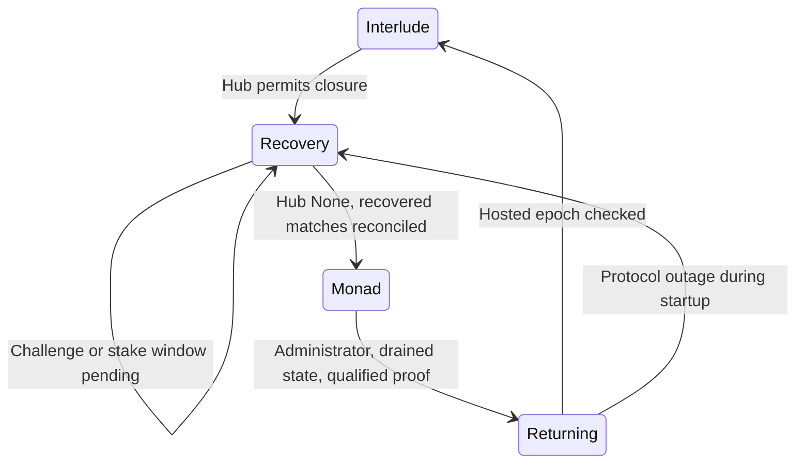

# Contract authority candidate

Status: preparation branch only. No production contract, environment variable, database, user session or deployment manifest is changed by this work. The current site keeps its existing coordinator and financial deployments.

The requested deployment target is now the existing production testnet site, without a separate preproduction site. Interlude is the preferred engine; Monad is its protocol-gated fallback, not a temporary default. That authorization does not supply the missing Chaos proof transport or the unfinished client integration. The technical blockers below still prevent activation.

The candidate moves admission decisions into contracts. It does **not** establish that the hosted Interlude operator can safely publish this larger state surface. `scripts/authority-preflight.ts --require-ready` deliberately fails while the qualification gates below remain open.

## Contracts and boundaries

| Component | Responsibility |
| --- | --- |
| `AutonomousArena` | Existing Classic/Chaos physics, scores, results, execution guard, scoped commands, immutable module addresses |
| `AuthorityActions` | Fixed delegatecall module for lobby actions, query API, checkpoint verification and recovery orchestration |
| `AuthorityLifecycle` | Fixed linked completion bookkeeping, shared-session drain marker and terminal match references |
| `ContractLobby` | Global participation lock, deterministic bounded matching, eight-member rooms, proposals, invitations, rotation and expiration |
| `AuthorityRating` | Existing ELO arithmetic, placement multiplier, daily repeated-opponent reduction |
| `PlayerIndex` | Append-only unique player discovery per mode, paginated without PostgreSQL |
| `AutonomousFinance` | Monad betting windows, fixed checkpoints and final result adapter for the existing `MarketV4`/`Vault` contracts |
| `ProfileRegistry` | Unique usernames, twelve avatar identifiers, migration reservations and owner-signed updates |
| `PrivateDataStore` | Separate encrypted notebook/contact heads, chunk verification, atomic version publication |
| `UnsupportedChaosProof` | Rejects every proof. It is the only proof implementation shipped in this candidate. |

The arena and module are non-upgradeable. There is no function to replace the actions module, proof verifier or ELO source. Libraries are linked at deployment. All delegated business data uses the registered `words` mapping at slot zero. Recovery control uses a separate, unregistered namespace. Modules must be deployed from the audited build and their code hashes included in the qualification manifest. Merely accepting any address with code in the constructor is not a deployment audit.

The arena's ABI is the union of its own ABI and `AuthorityActions`: fallback calls execute the fixed module in the arena's storage. Read the module **at the arena address**, not at its standalone address. `scripts/authority-preflight.ts` generates the combined ABI privately in `artifacts/authority/arena-abi.json`.

## Matchmaking and rooms

There is no server-signed match ticket. A player's owner-authorized arcade key submits a queue, invitation or room action. Anyone may trigger bounded matching or expiration. Such a caller cannot supply a chosen pair, score or winner.

- One occupancy entry per account covers both modes. It is scoped to the execution generation.
- Queue heartbeats last thirty seconds; clients should refresh them every ten seconds. Expired entries are removed by bounded maintenance or explicit cancellation.
- Matching traverses FIFO candidates with persisted cursors, at most 32 scan steps per call. The ELO window starts at 100 and widens by 50 every fifteen seconds, capped at 600. Incompatible older players do not prevent compatible later players from being examined. The scan restarts from the oldest candidate after a complete traversal.
- Matchmaking rooms are ranked and cannot be joined by arbitrary third parties. Created rooms and invitations are friendly.
- Rooms have at most eight members. The winner is offered the next game first; the loser goes to the end. Accept/decline expiration marks nonresponding players away. Rejoin puts an away player at the end.
- Two proposal slots reserve the two game places. Both participants must accept the immutable proposal before game state is created. Repeated acceptance cannot create a second game.
- Proposals last twenty seconds; direct rematches last sixty. Targeted invitations last ten minutes. Accepting an invitation also accepts the recipient's first offered duel when one is available.
- A room without members expires after thirty minutes; other inactive rooms expire after twenty-four hours. An active participant must concede before leaving. The oldest remaining member becomes host.
- Invitations are recipient-bound, block-aware and limited by a per-pair sixty-second cooldown. Events provide the notification source; their recipients and room IDs are public.

The initial rematch candidate requires both former opponents still to be in the same two-member room. Inviting a former opponent who has left, and rematches from larger rooms, still need client orchestration with explicit departure/occupancy checks. Do not advertise the broader rematch flow as migrated.

Historical references remain `10143:<deployment>:<matchId>`. New IDs include the execution generation in the upper 128 bits. Use bigint internally and decimal strings in JSON; the existing numeric ID parsers cannot represent them safely. An old URL must never be resolved against the current deployment by ID alone.

## Authorization and sponsoring

Interlude commands use the existing SDK `withSession` grant with `command` as the sole allowed application selector. `command` additionally checks the execution generation and an internal allowlist. The existing per-player input sequence and block deadline still apply. The user's wallet derivation is unchanged.

The candidate command now has the signature `command(uint256 expectedGeneration,uint256 expectedEpoch,bytes data)`. The second argument binds the actual delegation epoch, separately from the owner's session revocation epoch. A normally renewed delegation can reuse an unexpired owner grant, but a command signed for the previous delegation fails. Use `shared/authority-client.ts::engineCommand` and refresh the SDK's observed node epoch and nonce before sending. The old two-argument candidate encoding is obsolete; no production client uses either candidate ABI yet.

Monad uses an additional EIP-712 authorization, not a relayed invocation of SDK `withSession`:

```
Domain: PONGIT Autonomous Arcade / 1 / chain 10143 / arena address
ArcadeGrant(player, key, generation, epoch, expires)
ArcadeCommand(grantHash, dataHash, nonce, deadline)
```

The owner signs the grant; the limited key signs commands. The grant binds the deployment through its domain, the account, execution generation, hub revocation epoch and expiry. Command nonces are sequential per grant. Expiration, revocation, account mismatch, altered calldata and replay revert before application state changes. Reverted calls roll back nonce consumption.

Only game actions are allowed. Profiles, encrypted uploads, deposits, bets, withdrawals, tournament entry and administration never gain authorization from the arcade key. Profiles and private-data upload roots use separate owner-signed `OwnerWrite` domains and nonces. The existing V4 finance contracts retain their spending signatures and fixed-beneficiary, permissionless payment triggers.

`relayer/src/authority-keeper.ts` is an unconnected candidate executor. It builds a finite set of zero-value maintenance calls, simulates them and delegates submission to an injected persistent sponsor journal. An uncertain transaction is reconciled before any new submission. Repeated work binds its observed contract state: proposal cycle, game revision, rally or payout attempt. A missing sponsor returns `waiting_for_sponsor`; there is no player-paid fallback. It is intentionally not imported by production `main.ts` and does not create a second nonce owner. Liquidity funding still requires the existing separately authorized operator flow.

## Execution and recovery



Candidates initialize in Monad for isolated testing. An eventual production initialization must complete the Interlude startup qualification before admission. A 429 response, client timeout or missing receipt cannot itself change the onchain execution state.

`beginRecovery` checks the actual hub session. For an active delegation, only protocol expiry or publication silence permits force closure. A challenge prevents recovery completion. `finishRecovery` waits for `releaseStake` and status `None`, preserves terminal recovered results, cancels recovered unfinished games without ELO and advances the execution generation. The financial adapter then exposes their cancellation for refunds. Admission and inputs are blocked on Monad while Interlude, Recovery or Returning is active.

Return is administrator-only, requires no active games/proposals, sealed finance and a supported proof verifier. The new delegation must be opened successfully; `confirmInterlude` checks its epoch and expiry. Node health/publication verification remains an operator qualification task, not a fact inferred from that last transaction alone. Admin and browser diagnostics can use `ExecutionChanged` and `shared/authority-client.ts::logTransition` without including grants, signatures or private data.

### Recovery service and warnings

`shared/authority-recovery.ts` defines the engine policy. A healthy delegation continues on Interlude. Rate limiting or a single failed request pauses admissions without changing engines. Non-rate-limit failure lasting at least fifteen seconds across three observations also needs the hub's publication-silence condition before requesting recovery. Delegation expiry or an already closed delegation can independently permit that request. A challenged delegation blocks completion. Monad admission begins only after the canonical controller reports `Monad` and the hub reports `None`.

`shared/authority-recovery-source.ts` reads the actual controller and hub at one Monad block, validates the configured hub and rechecks the block hash. It rejects the engine chain as a source of fallback authority. This is an RPC adapter, not a cryptographic proof of Monad state inside Interlude; it does not resolve the Chaos proof gate.

`relayer/src/authority-recovery.ts` provides a single-flight worker with a second observation before submission. Recovery operations are identified by chain, arena, execution generation, delegation epoch and action. The injected persistent nonce journal must record signed bytes before broadcasting. Submitted or uncertain operations are reconciled, never treated as missing because a response was lost. Confirmed failures require inspection. Sponsor unavailability leaves the operation waiting and never charges a player. The worker does not open a new Interlude delegation automatically.

The `pongit.execution` diagnostic distinguishes `actual`, `requested` and `status`, with a UTC timestamp, generation, epoch, block/hash and transaction hash when available. Recovery, fallback, startup and blocked states use warning severity. Repeated identical observations are suppressed. Worker failures report a normalized stage without raw RPC exceptions, credentials, signatures or private content. `logTransition` also uses warning severity for confirmed transitions to Recovery or Monad.

### Normal completion and undelegation

The legacy service only drains near the delegation's daily expiry. The candidate now begins draining when the first engine match finishes. New admissions, acceptances and rematches pause; the other already active game can still receive inputs, finish or be conceded. Outstanding proposals may be declined or expire under their existing rules. Declining an invitation and cancelling an existing queue remain possible before sealing.

After both game slots and proposals are clear, anyone can execute `sealCompletedSession(expectedEpoch)` on the engine. The delegated marker freezes application writes, including lobby maintenance and rating imports. `closeCompletedSession(expectedEpoch)` then runs on Monad and requires that exact marker in published storage, no active games and the matching active hub epoch. A terminal result without a published seal cannot close the session. The contract calls `hub.closeDelegation`; the frontend cannot manufacture a seal or close another epoch.

The controller reports `Returning` with reason `MATCH_SESSION_CLOSED`. This normal closure is distinguished from a failure by the canonical recovery adapter: it does not automatically invalidate room generations or enter Monad. An arbitrary maintenance caller cannot convert that normal wait into disaster recovery. An administrator can explicitly request recovery if normal renewal must be abandoned. The candidate worker can schedule an epoch-bound `closeCompletedSession` through the existing journal port after observing a canonical published seal. It rechecks that observation and reconciles uncertain submissions. It never signs with a second nonce owner or automatically performs the administrator renewal.

`renewCompletedSession(expectedEpoch)` is administrator-only. It waits for the hub to reach `None`, including stake release and any contestation. It requires the recovered seal still to match. Before opening another delegation, it finalizes the two recorded outcomes in the immutable finance adapter so that later payments no longer depend on contestable game reads. It clears the closure markers and opens a new epoch while retaining rooms, their winner/queue order and ELO. Hosted provisioning and `confirmInterlude` remain separate qualification steps.

This is a **shared-session drain candidate**, not independent per-match delegation. The current hosted deployment combines two matches and the lobby in one global partition. Both its existing delegation and the default validator's current terms have a 3,600-second challenge window. Therefore this candidate cannot presently provide uninterrupted successive Interlude matches. Per-match partitioning/provisioning, or a qualified protocol renewal mechanism, is still required before activation. See [reset qualification and operator requirements](INTERLUDE_RESET.md).

The lifecycle library adds terminal-result and seal writes to the same delegated surface. Re-measure the publication budget; prior measurements are not release evidence for this revision. Pure EVM tests simulate hub closure and challenge handling; they do not establish publication or recovery on the hosted node.

These modules remain unconnected to production. Deploying them alone would not enable fallback on the older immutable arena. Production still needs the new arena, finance proof qualification, generation-aware client routing and persistent sponsor integration.

An engine retains a pinned view until protocol recovery. The simulated dual-chain tests are not evidence that a hosted node stopped accepting its old epoch. Test that behavior with the operator, including SDK revocation visibility, before activating automatic recovery. No browser may continue using a stale node after the base controller changes generation.

## Ranking and migration

The contract preserves the existing formula, mode separation and season genesis. Friendly games and cancellations do not rate players. `rankedPlayers(mode, offset, limit)` discovers up to 100 addresses per page; ratings are read at a common block or engine snapshot. The browser sorts by ELO descending and lowercase address ascending. Live, published and protocol-final snapshots must be labelled separately.

`importRating` reads only a source whose hub reports `None`. Actual migration must pin and validate the source state, keep the source inactive, enumerate/import every ranked player and compare both full registries. This has not been performed. The old contract does not expose its private daily opponent counters. Schedule cutover after a UTC-day boundary with no legacy play that day, or implement a verified counter import before preserving within-day limits across deployments. A new counter must not be presented as historical continuity.

Reserve existing usernames in batches before calling `ProfileRegistry.seal`. Reservations are assigned to existing owners and then claimed with owner signatures. No public registration is allowed before sealing. Names are 3–20 ASCII characters, begin with a letter, and are unique ignoring case. Avatar IDs are 0–11.

## Encrypted data

Notebook and contacts use distinct namespaces. Notebook PRF/HKDF derivation and associated data remain compatible with the existing client. Contacts use `pongit.xyz/contacts/v1` and a separate HKDF info string. Obtain the matching PRF output from the same Mera passkey; never reuse the wallet private key as encryption material.

The private client prepares ciphertext-only chunks, a Merkle root and full ciphertext hash. Upload roots are owner-signed. Each save has a fresh 12-byte AES-GCM nonce. Up to sixteen 4 KiB chunks support a 64 KiB ciphertext, exceeding the current notebook API's 60,000-character base64 bound. Oversized data is rejected without truncation. The key is nonextractable and remains in memory; raw PRF bytes and temporary plaintext bytes are cleared when possible. JavaScript strings cannot be reliably zeroized, so applications must also drop all references when closing the notebook.

Anyone may relay already-authorized chunks and commit a complete upload. Readers keep using the old head until all chunks and the full hash match. `expectedRevision` enforces compare-and-swap, including concurrent device saves. A duplicate successful commit is harmless. Incomplete uploads expire after one day; they do not erase the last complete head.

Resuming an upload checks its owner, namespace, expected revision, root, full ciphertext hash, size and IV against the attempted save. A lost successful commit response is recovered by matching that exact upload to the new head. A resume ID must never be reused for newly encrypted content.

Ciphertext, wallet association, lengths, IVs and old versions are permanent public chain data. Disconnecting only removes local keys and decrypted state; it does not erase uploaded ciphertext. Contacts must be exported through the existing authenticated account API and encrypted in the browser. No plaintext contact list or notebook is sent to a contract.

Frames are not added to contracts. Existing replay retention, financial rights, legacy vaults, manifests and transaction journals remain untouched.

## Validation and release gates

Run on an isolated VPS runner using the repository's existing toolchain:

```sh
forge test --root contracts
node --import tsx --test tests/authority.test.ts
node --import tsx --test tests/authority-recovery.test.ts
npm run typecheck
node --import tsx scripts/authority-preflight.ts
node --import tsx scripts/differential-interlude.ts
node --import tsx scripts/differential-rooms-chaos.ts
```

The differential scripts start private local Anvil processes inside that runner. They do not call the production engine. All candidate test keys and permissive hub/proof fixtures belong exclusively to tests.

See [qualification evidence](AUTHORITY_QUALIFICATION.md) for measured results and unfulfilled gates. No production deployment command is supplied. Restore/rollback currently means leaving the existing release active; there is no candidate migration to undo.
