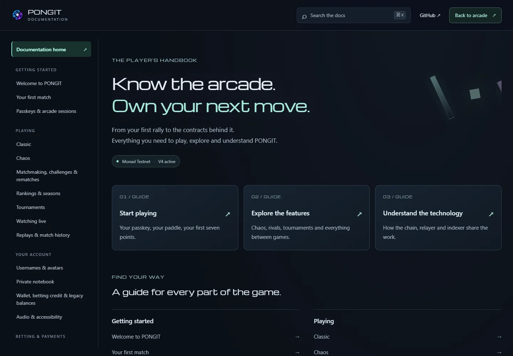

# PONGIT Docs delivery: September 7, 2026

The English handbook is live at **https://pongit.xyz/docs**. The arcade header opens it in a separate tab on desktop and mobile. Its 24 articles cover the delivered game and technical interfaces, with a local search index, section links, a responsive chapter menu, a table of contents, source links and revision dates.

## Published behaviour

- Direct documentation visits require no account and start no game engine, passkey ceremony, music, business API calls or WebSocket. Even the return-to-arcade link disables game-route prefetch.
- The sidebar, headings and local search come from the same reviewed MDX catalogue. All 24 static articles, their anchors and four screenshot assets resolve; unknown article URLs return HTTP 404. Each article has its own canonical metadata and is listed in the sitemap.
- Docs uses a static dark background, Michroma headings and system-font reading text. Tables explicitly override the game's typography, retain 16px body text and scroll horizontally on narrow screens. Search and mobile navigation support keyboard focus, Escape and focus restoration.
- The content covers Classic/Chaos, friendly/ranked play, separate ratings, direct challenges and rematches, passkeys, two-hour arcade sessions, unique usernames, twelve avatars, private notebook encryption, betting, V4 wallet payments, legacy balances, tournaments, live viewing, replay retention, audio and recovery. Technical guides document the real HTTP/WebSocket interfaces, permissions, physical simulation and operations.
- Contract tables expose only allowlisted fields from the public V1–V4 manifests. Interlude is explicitly described as paused and unavailable. Ordinary match wins do not promise a MON prize.

## Validation

The [machine-readable evidence](evidence/docs/validation.json) records browser versions, cases, release reference and the two live friendly match references.

| Check | Result |
| --- | --- |
| TypeScript suite | 23 tests passed; documentation search/content test checked again after final prose edits |
| Typecheck and Linux production build | Passed |
| Private VPS browser checks | 9 reading/navigation cases plus a three-account game integration passed |
| Public Chrome and Edge | 10 scenarios per browser passed: 9 documentation cases and one live game case |
| Viewports | 360 × 640, 390 × 844, 768 × 1024, 1440 × 1000, 844 × 390 and 720 × 450 |
| Articles, headings, local images, canonical URLs, sitemap and 404 | Passed |
| External article links | Eight returned HTTP 200 |
| Secrets audit | No findings in publication changes or full Git history |
| npm audit, application dependencies | Zero reported vulnerabilities |

Live checks used three isolated virtual PRF accounts per browser, a targeted friendly challenge and a spectator. Opening Docs preserved the original arcade session; no session key was copied into the new tab and no additional passkey assertion was needed on return. The spectator opened the real bet review without submitting a financial purchase, and the game ended with a confirmed result. The public smoke test deliberately avoids the normal queue and ranked leaderboard.

Initial integration selectors expected labels without their decorative arrows. Those test selectors were corrected; the final integration scenarios passed. The final typography adjustment was followed by another complete documentation suite on both browsers.

## Deployment and recovery

Application release **d0060d9** includes the handbook and final table typography. Production remains on the existing VPS, with the same V4 contracts, financial rules and database schema. No service was moved to GitBook or Interlude.

Backups were taken before activation, most recently `20260907T083435Z`; the protected offsite-copy task completed successfully. Previous releases and web/relayer images are retained. The private test stack, its network, temporary database volume and project images were removed after validation; production volumes were preserved.

To return to the first complete documentation release, use the existing compatible V4 rollback procedure with:

```sh
bash ops/rollback-v4.sh 9558069ee05a5d1cf3c821092f3899dca55b9d92
```

The corresponding image tags are `pongit-web:docs-initial` and `pongit-relayer:docs-initial`. This rollback preserves documentation, game permissions and all V4/legacy financial rights; it only predates the final table-font adjustment. The older pre-docs application is also retained under the separate `docs-previous` image tags. See [authoring and deployment](DOCUMENTATION.md) for maintaining this handbook.

## Limits of these checks

Virtual PRF tests are not physical passkey-provider or cross-device certification. This documentation release reviewed financial instructions against the implementation and exercised the bet review, but did not repeat every payment, tournament and legacy withdrawal regression. The 720px reflow check is equivalent to fitting a 1440px layout at 200%; it is not a physical browser zoom measurement. A production rollback was prepared, not executed. No new latency guarantee is made.



[Mobile home](evidence/docs/home-mobile.webp) · [Technical article and contracts](evidence/docs/contracts-desktop.webp)
