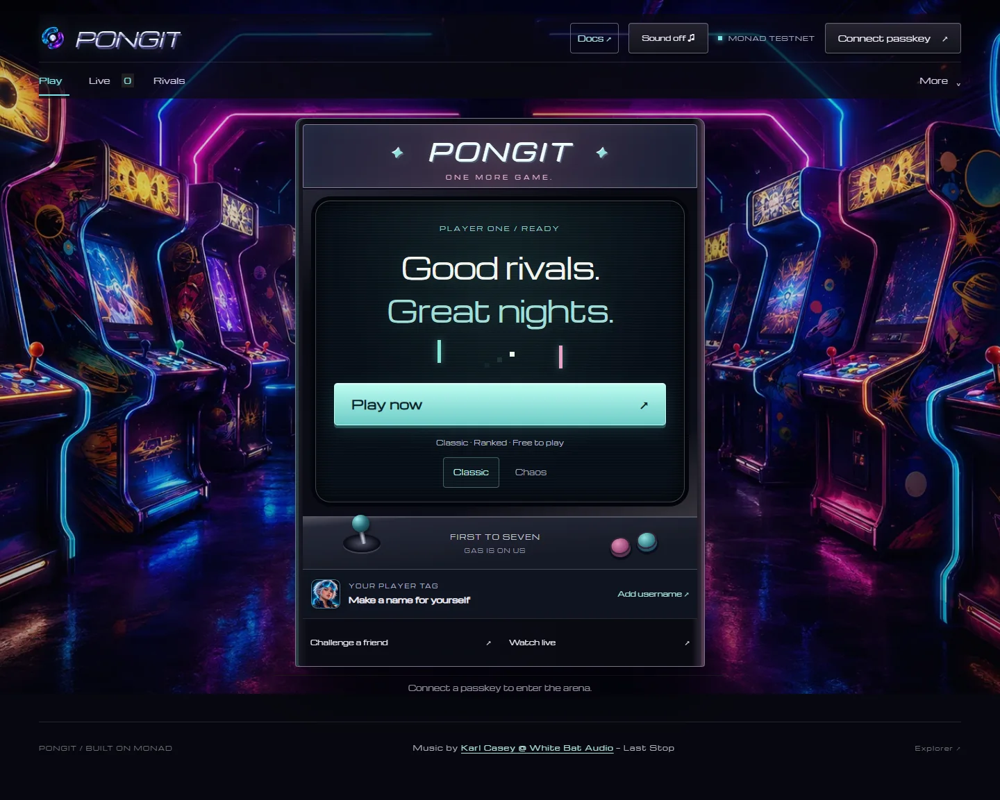
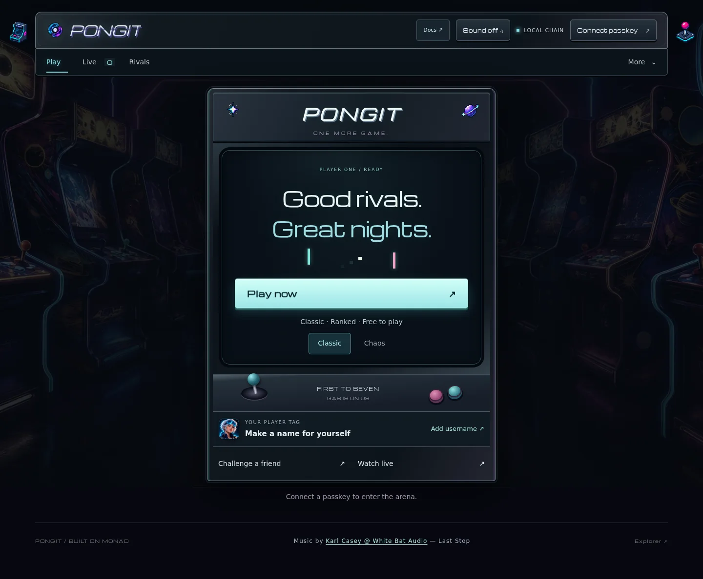
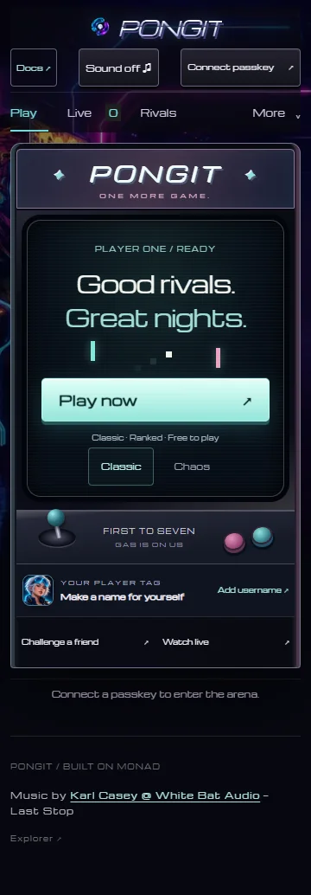
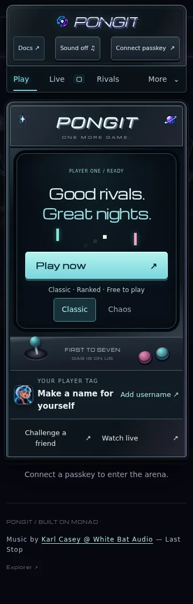

# Neon Cabinet delivery

Reviewed on 7 September 2026. This release gives the existing arcade and documentation a shared graphite-metal, smoked-glass and cyan/violet identity. The court stays black, rectangular and 16:9. Navigation, logo, avatars, financial rules and deployed contracts are preserved.

## What changed

- Shared material, color and typography tokens, with separate arcade and documentation styling. Michroma remains on headings, scores and short buttons; reading text and forms use the system font.
- A static, desaturated arcade room with opaque panels and fine cabinet bevels. Mobile uses a lighter frame and retains a visible **Play now** action at 360 × 640.
- Four original transparent sprite strips: miniature cabinet, joystick, ringed planet and star. Eight frames occupy approximately one second of each twelve-second cycle, starting at 0, 3, 6 and 9 seconds respectively. The strips move with stepped CSS transforms; no additional animation-frame loop or 3D engine is introduced.
- Decorations are outside the court, non-interactive and hidden from assistive technology. Offscreen and hidden-tab animations pause. Reduced motion and disabled **Background effects** display a rest frame. Mobile shows at most two small details; documentation details always remain still.
- Matching account, profile, invitation, payment, operator and result surfaces. The previous multicolor court glow was removed; result panels now have an opaque background.
- Updated documentation settings guide and four feature screenshots. Existing saved preferences, music and arcade sessions retain their storage format.

The original sprite atlas and reproducible preparation script are in [artwork/neon-cabinet](../artwork/neon-cabinet/README.md). Optimized browser strips total 88,259 bytes. The existing static room artwork is reused.

## Validation before publication

The private, temporary VPS stack uses a separate Anvil chain, databases and network. Financial test fixtures never touch production roles or balances.

| Check | Result |
| --- | --- |
| TypeScript unit suite | 23 passed |
| Type checking and production Next.js build | Passed |
| Documentation catalog | 24 articles, 135 headings, 41 validated internal links and four deployment generations |
| Responsive navigation and dialogs | Passed at 360, 390, 768, 1440 px, and 844 × 390 / 720 × 450 landscape layouts |
| Local search, copied anchors/code, static routes and genuine 404 | Passed |
| New-account play intent, double-click protection, cancellation and renewal | Passed |
| Pixel phases, rest frames, visibility, preference persistence and reduced motion | Passed |
| Friendly game, keyboard/touch, F5 and VICTORY / DEFEAT actions | Passed; arcade-session fingerprint preserved |
| Docs opened from a live game; spectator bet review | Passed without a new passkey ceremony or a wallet/game instance in docs |
| Audio signal, settings and mute/return behavior | Existing Neon audio browser scenario passed |
| Tournament, automatic wallet prize and three legacy withdrawals | Passed |
| Two winning bettors, offline recipient, losing position and concurrent play | Passed |
| Authorized administration and profile dialogs | Passed at desktop and mobile sizes |

An initial pair of new sprite assertions used the wrong computed-style representation and selected a decorative heading rather than body copy. Those assertions were corrected; subsequent runs passed. Frame-time measurements were repeated with browser tracing disabled because canvas recording distorted results.

## Rendering measurements

These are short Chromium samples in the VPS sandbox, not physical-device benchmarks or network latency measurements. The static room remains enabled in both samples, isolating the sprite setting. Mobile uses a 390 px touch viewport and four-times CPU slowdown. Normal run-to-run scheduling variation is visible; these measurements do not establish a universal FPS guarantee.

| View | Sprites off | Sprites on | Frame-time p95, off / on |
| --- | ---: | ---: | ---: |
| Home, desktop, 13 s | 58.8 FPS | 59.9 FPS | 16.8 / 16.7 ms |
| Home, mobile emulation, 13 s | 60.0 FPS | 60.0 FPS | 16.7 / 16.7 ms |
| Live court, desktop, 6.5 s | 54.0 FPS | 52.2 FPS | 33.3 / 33.3 ms |
| Live court, mobile emulation, 6.5 s | 58.5 FPS | 59.7 FPS | 16.8 / 16.7 ms |

Raw samples: [decoration](evidence/neon-cabinet/decoration-performance.json), [live court](evidence/neon-cabinet/live-performance.json). Desktop arena cost warrants continued observation on low-power hardware; the effects switch remains available.

## Visual evidence

| Before | After |
| --- | --- |
|  |  |
|  |  |

Additional captures: [desktop court](evidence/neon-cabinet/game-desktop.webp), [mobile court](evidence/neon-cabinet/game-mobile.webp), [result](evidence/neon-cabinet/victory-mobile.webp), [documentation](evidence/neon-cabinet/after-docs.webp). These pre-release captures use the isolated test chain and are identified as such in the header.

## Release and rollback

Production backup `20260907T095131Z` completed on the VPS; database checksums were checked during its private offsite copy. Both copies contain operational secrets and are deliberately outside Git. Backup retention remains seven days.

The previous production release is `d0060d938a574c40d6396f46a6aaecea9fc32a0f`. Deployment builds and replaces the web container only after checking for active matches. The relayer, indexer, database and V1–V4 financial contracts require no migration. Interlude remains paused.

Before activation, retain the running web image as `pongit-web:neon-cabinet-previous`. For a web rollback, point `/opt/pongit/current` back to the previous release, tag that retained image as `pongit-web:latest`, then run `docker compose up -d --no-deps web` from `/opt/pongit/current`. Check the public homepage, docs, assets and relayer health afterwards. No database restoration is needed for this styling release.

The dependency production audit reported zero known vulnerabilities. The publication scan covers local Git history and reflogs, tracked files and the index, searching both known operator secrets and credential patterns. The candidate database URLs were reviewed as environment-variable templates or documented local-only fixtures; no production secret was found.

Public HTTPS checks and the final published revision will be recorded after activation. Physical mobile hardware, physical cross-device passkey recovery and listening through the user's actual speakers remain outside these automated checks.
